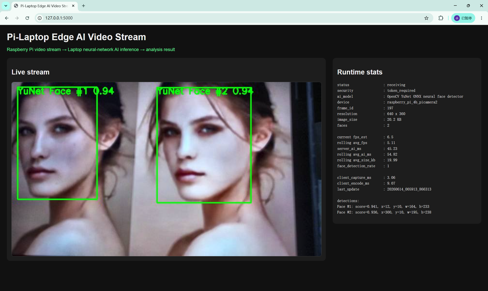

# Pi-Laptop Edge AI Video Stream

## Overview

This repository contains a sealed demo of a two-device edge AI video stream system. Device A is a Raspberry Pi 4 Model B with a Raspberry Pi Camera IMX708. Device B is a Windows laptop. The Raspberry Pi captures and lightly preprocesses video frames, sends them over Wi-Fi with HTTP POST, and the laptop runs a neural-network-based face detector, visualizes results, and records logs.

The demo is designed for the required assessment format: code repository, necessary documentation, and a real demo video. No report or PPT is required in this repository.

## Demo Preview

[](media/demo_system_run.mp4)

Click the screenshot above to open the recorded system demo video.

Demo video: [`media/demo_system_run.mp4`](media/demo_system_run.mp4)

Hardware setup: [`media/hardware_setup.jpg`](media/hardware_setup.jpg)

## Demo Performance Snapshot

The following values come from the sealed demo logs and runtime summary. They describe this recorded demo run under the current Wi-Fi/hotspot setting and are not a claim of guaranteed high-frame-rate performance.

| Metric | Demo value |
| ------------------------------ | ---------: |
| Resolution | 640 × 360 |
| Final frame ID | 218 |
| Average FPS | 5.02 |
| Average laptop AI latency | 37.34 ms |
| Average JPEG frame size | 18.4 KB |
| Detected faces in final frame | 1 |
| Face confidence in final frame | 0.931 |

## Assessment Requirement Mapping

| Requirement | How this project satisfies it |
| --- | --- |
| Two-device system | Raspberry Pi 4 Model B plus Windows laptop |
| A is weaker and B is stronger | Raspberry Pi handles capture/preprocessing; laptop handles neural AI inference and visualization |
| Raw video stream originates from A | Frames are captured on Raspberry Pi through Picamera2 and the IMX708 camera |
| A performs initial computation/preprocessing | Frame-rate control, 640x360 sizing, CLAHE enhancement, mild sharpening, and JPEG compression run on Raspberry Pi |
| Data flows from A to B over Wi-Fi | Raspberry Pi sends frames to the laptop Flask service using HTTP POST over the local network |
| B runs neural-network-based AI | Laptop runs OpenCV YuNet pre-trained ONNX neural face detector |
| Useful analysis results | Face count, bounding boxes, confidence scores, AI inference time, FPS estimate, annotated stream, and logs |
| Code repository + documentation + demo video | Source code, setup files, `docs/`, sealed logs, screenshots, hardware photo, and demo video are included |
| No report/PPT required | The repository focuses on source code, necessary documentation, sealed logs, screenshots, hardware photo, and recorded real-device demo video |

## Device Responsibilities

### Device A: Raspberry Pi

- Hardware: Raspberry Pi 4 Model B + Raspberry Pi Camera IMX708
- Script: `raspberry_pi/pi_video_stream_upload.py`
- Captures frames with Picamera2.
- Controls frame rate to approximately 5 FPS under the current Wi-Fi/hotspot setting.
- Uses 640x360 frames.
- Performs edge-side preprocessing.
- Compresses frames as JPEG.
- Uploads frames to the laptop through Wi-Fi and HTTP POST.
- Records a client-side CSV upload log.

### Device B: Laptop

- Hardware: Windows laptop
- Script: `laptop/receiver_stream_ai.py`
- Runs a Flask receiver service.
- Validates a simple shared token for the local network demo.
- Decodes uploaded JPEG frames.
- Runs OpenCV YuNet ONNX neural face detection.
- Draws detected face boxes and confidence values.
- Serves an annotated MJPEG browser stream.
- Exposes runtime stats and JSON results.
- Records laptop-side CSV and JSON logs.

## System Architecture

```text
Raspberry Pi Camera
    -> Raspberry Pi Picamera2 capture
    -> edge-side preprocessing
       -> frame-rate control
       -> 640x360 resize/configuration
       -> CLAHE local contrast enhancement
       -> mild sharpening
       -> JPEG compression
    -> Wi-Fi HTTP POST
    -> Laptop Flask receiver
    -> OpenCV YuNet ONNX neural face detection
    -> annotated MJPEG stream + runtime stats + JSON response + CSV/JSON logs
```

More detail is available in `docs/architecture.md`.

## Hardware Requirements

- Raspberry Pi 4 Model B
- Raspberry Pi Camera with IMX708 sensor
- Windows laptop
- Local Wi-Fi network or mobile hotspot shared by both devices

## Software Requirements

Laptop:

- Python 3
- Flask
- OpenCV Python
- NumPy
- OpenCV YuNet ONNX model

Raspberry Pi:

- Raspberry Pi OS with camera support enabled
- `python3-picamera2`
- `python3-opencv`
- `python3-requests`

## Edge-Side Preprocessing on Raspberry Pi

The Raspberry Pi performs lightweight preprocessing before sending frames:

- frame-rate control with `TARGET_FPS = 5`
- 640x360 frame configuration
- CLAHE local contrast enhancement on the LAB luminance channel
- mild sharpening with Gaussian blur and weighted blending
- JPEG compression with configurable quality

This keeps the weaker device responsible for capture and initial computation while leaving neural network inference to the stronger laptop.

## Communication

Frames are sent from Raspberry Pi to laptop through Wi-Fi using HTTP POST:

```text
http://YOUR_LAPTOP_IP:5000/upload_frame
```

The example laptop IP in the Pi script is a local-network placeholder. Update `LAPTOP_IP` for the actual network before running. Do not store Wi-Fi passwords or private tokens in the repository.

## AI Model on Laptop

The laptop uses the pre-trained OpenCV YuNet ONNX neural face detector:

```text
models/face_detection_yunet_2023mar.onnx
```

This model is not self-trained in this project. It is used as an existing pre-trained neural-network-based face detector for the demo.

## Third-party Model Note

- The neural detector is the pre-trained OpenCV YuNet ONNX face detection model.
- The model was not trained from scratch in this project.
- The project contribution focuses on system integration, Raspberry Pi edge-side preprocessing, Wi-Fi frame transmission, laptop-side neural inference, dashboard visualization, and logging.

## Output

The system outputs:

- annotated MJPEG stream in the Flask web page
- Runtime stats dashboard
- JSON response for each uploaded frame
- detected face count
- face bounding boxes
- confidence scores
- AI inference time
- FPS estimate
- laptop CSV detection log
- laptop JSON runtime summary
- Raspberry Pi client CSV upload log

## Security

The demo uses a simple shared token in the HTTP form data to reject unauthorized local uploads. This is suitable only for a local network classroom/demo setting. It is not a production authentication design.

## Demo Video and Screenshots

Demo media is stored in `media/`:

- `media/demo_system_run.mp4`
- `media/web_demo_screenshot.png`
- `media/hardware_setup.jpg`

The video was captured from the real Raspberry Pi and laptop hardware test corresponding to this sealed repository state.

## Further Improvements for Requirement 9

This project already strengthens the demo in the directions usually expected by the additional improvement item:

- Functionality: two-device video stream, edge preprocessing, laptop neural face detection, and annotated output.
- Real-time behavior: FPS estimate, average FPS, AI latency, and frame size are measured and shown.
- Practicality: browser dashboard, MJPEG annotated stream, screenshots, hardware photo, and recorded demo video are included.
- Stability: fixed dashboard layout, rolling averages, key-frame saving, and CSV/JSON logs are used.
- Security: a simple shared token is used for the local-network demo.

## Logs Explanation

Demo logs are stored in `logs/`:

- `logs/stream_detection_log_demo.csv`: laptop-side detection records, including frame ID, face count, inference time, FPS estimate, detections, and saved annotated file path.
- `logs/runtime_summary_demo.json`: laptop-side runtime summary from the Flask receiver.
- `logs/client_stream_log_demo.csv`: Raspberry Pi client upload log, including capture, preprocessing, encoding, upload timing, HTTP status, and returned detection summary.

Runtime executions may also generate `logs/stream_detection_log.csv`, `logs/runtime_summary.json`, `stream_received/`, and `stream_annotated/`. Generated frame folders are ignored by Git to avoid committing large raw/annotated frame dumps.

## How to Run: Laptop Side

Open PowerShell in the repository root:

```powershell
cd laptop
python -m venv .venv
.\.venv\Scripts\python.exe -m pip install -r requirements.txt
.\.venv\Scripts\python.exe receiver_stream_ai.py
```

Open:

```text
http://127.0.0.1:5000/
```

For receiving frames from Raspberry Pi, open the laptop's LAN address from the same network, for example:

```text
http://10.253.24.73:5000/
```

## How to Run: Raspberry Pi Side

Copy or clone the repository to the Raspberry Pi, then run:

```bash
cd ~/edge_pi_project
cd raspberry_pi
bash setup_pi.sh
python3 pi_video_stream_upload.py
```

Before running, edit `raspberry_pi/pi_video_stream_upload.py` and set:

```python
LAPTOP_IP = "10.253.24.73"
```

Replace the example IP with the actual laptop IP on the same Wi-Fi/hotspot network.

## Limitations

- The local shared token is intentionally simple and is not production-grade security.
- Performance depends on Wi-Fi/hotspot quality, lighting, camera placement, and laptop CPU load.
- The target stream rate is approximately 5 FPS under the current demo network setting, not a guaranteed high-frame-rate real-time system.
- The face detector is a pre-trained model and was not fine-tuned for this specific room, camera, or lighting condition.
- The system currently uses HTTP POST frame upload rather than a lower-latency streaming protocol.

## Future Improvements

- Move secrets such as shared tokens to environment variables.
- Add automatic laptop IP configuration or discovery.
- Add HTTPS or stronger local authentication.
- Add multi-person tracking IDs across frames.
- Add bandwidth adaptation for unstable Wi-Fi.
- Add more AI analytics, such as face presence duration or attention-state estimation, if allowed by the assessment scope and privacy requirements.

## AI Assistance Note

AI tools may have assisted coding, debugging, or repository cleanup. System integration and testing were performed on real Raspberry Pi and Windows laptop hardware using the sealed demo files in this repository.
